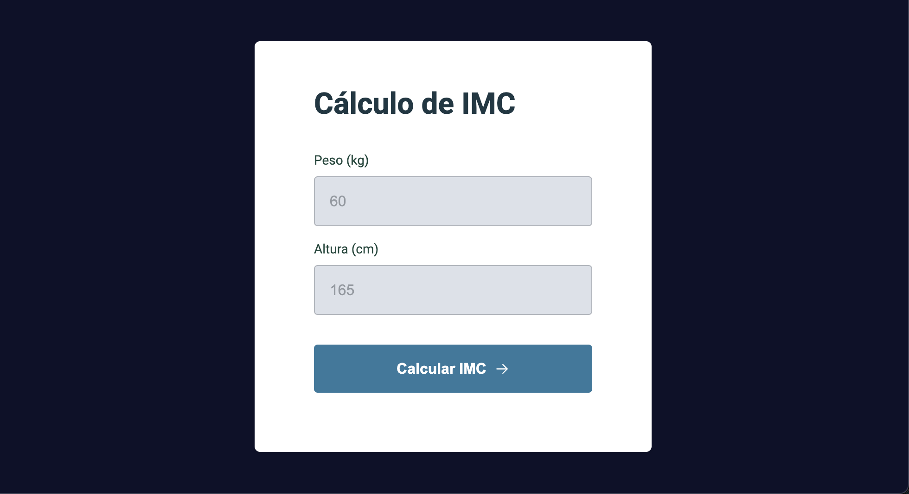

<h1 align="center"> Calculadora IMC </h1>

  <a href="#-tecnologias">Tecnologias</a>&nbsp;&nbsp;&nbsp;|&nbsp;&nbsp;&nbsp;
  <a href="#-projeto">Projeto</a>&nbsp;&nbsp;&nbsp;|&nbsp;&nbsp;&nbsp;
  <a href="#-layout">Layout</a>&nbsp;&nbsp;&nbsp;|&nbsp;&nbsp;&nbsp;

 

  

## 🚀 Tecnologias

Esse projeto foi desenvolvido com as seguintes tecnologias:

- HTML e CSS
- JavaScript
- Git e Github

## 💻 Projeto

Uma calculadora funciona de IMC

## 🔖 Layout

Você pode visualizar o layout do projeto através [DESSE LINK](https://www.figma.com/file/dNg62xLl9TiXxQLG3qp3jw/IMC-(Copy)?node-id=6%3A5&mode=dev). É necessário ter conta no [Figma](https://figma.com) para acessá-lo.

---

Feito com ♥ by Rocketseat codado por João Mauro Siqueira :wave: [Participe da nossa comunidade!](https://discord.gg/rocketseat)